# Camera Model Identification based on Bayesian Neural Network 

## Week 2

- The take away message from `What Uncertainties Do We Need in Bayesian Deep Learning for Computer Vision` is that they have a novel loss function incoperated both aleatoric and epistemic uncertainty, and the loss could be attenuated according to the uncertainty. Aleatoric uncertainty can't be reduced by enlarge the dataset, on the contrary, epistemic can.

- Which variational method in BNN should we use? Bayes by Backprop or using the dropout approximation? I did a little experiment by myself, turns out the dropout has smoother curve. In the paper 'Dropout as a Bayesian Approximation' states that the Bayes by Backprop is slower.

    > We use the stochastic variational inference, bayes by backprop is our focus. To summarize the different methods we talked about:
    >
    > - Softmax statistics, see Hendrycks and Gimpel
    > - Monte-Carlo dropout (MC dropout), see papers by Yarin Gal
    > - Ensembles, see Lakshminarayanan et al.
    > - Stochastic Variational Inference (SVI), e.g., Blundell et al. <--- focus our work
    > - Last layer SVI and Last layer dropout: Approximate Bayesian inference for last layer only.

- Aleatoric and epistemic uncertainty in camera model identification? Should I model it?

- How do you know the modeled uncertainty is correct? Evaluate it's log likelihood, RMSE and std. error?

- In the case of resampling artifacts,  the rescaling factor indicates the distance(dissimilarity) between the closeset samples and the unseen samples. But in camera identification, should we use such a dissimilarity?

## Week 3

- Why the MC Dropout predictiions looked "smoother" than the from the Bayesian neural network example from Martin Krasser. Turns out it is related to the `batch_size` you use during prediciton. When you use `model.predict(X_test)` Keras has a default value for `batch_size=32`. 
Would be great if you could repeat your experiments with `batch_size=1`.

    > `batch_size` means that the maximum number of GPU/CPU can handle at the same time, so if the `batch_size` is set to 32, then the model will wait for 32 inputs then predict 32 predictions all together. If I change the prediction number to 32, using `batch_size` or not present the same result. In the figure, the predictions show very distinct boundaries at the begining of every batch prediction, while inside the batch, the prediction of this points seems very smooth. 
    >
    > This is because the model takes the whole batch as a input, so they share the same random kernel and bias, which will result in linear output, so inside the batch, the output is smooth. When the next batch comes, the model has different random kernel and bias, so the output looks like it has a step.

- To do:
    - [x] Conv2d Bayesian by backprop using [flipout](https://www.tensorflow.org/probability/api_docs/python/tfp/layers/Convolution2DFlipout#args_1) or other [variational 2d](https://www.tensorflow.org/probability/api_docs/python/tfp/layers/conv_variational). 
    - [x] Read the paper of `Evaluating Predictive Uncertainty Under Dataset Shift`, in the Appendix A6 they have some Variational Stochastic Inference setup details. [Github repository](https://github.com/google-research/google-research/tree/master/uq_benchmark_2019).
      > For MNIST we used Flipout (Wen et al., 2018), where we replaced each dense layer and convolutional layer with **mean-field variational dense** and **convolutional Flipout layers** respectively. Variational inference for deep ResNets (He et al., 2016) is non-trivial, so for CIFAR we replaced a single linear layer per residual branch with a Flipout layer, removed batch normalization, added **Selu non-linearities (Klambauer et al., 2017)**, **empirical Bayes for the prior standard deviations** as in Wu et al. (2019) and careful tuning of the initialization via Bayesian optimization.
    - [x] try to use `selu` as the activation function.
      > `selu` needs to be initilized suitably. 
    - [x] This [blog post](https://blog.tensorflow.org/2019/03/regression-with-probabilistic-layers-in.html) introduce a trainable prior.
        ```python
        def prior_trainable(kernel_size, bias_size=0, dtype=None):
            n = kernel_size + bias_size
            return tf.keras.Sequential([
                tfp.layers.VariableLayer(n, dtype=dtype),
                tfp.layers.DistributionLambda(lambda t: tfd.Independent(
                    tfd.Normal(loc=t, scale=1),
                    reinterpreted_batch_ndims=1)),
            ])
        ```
    - [x] [Deterministic Variational Inference for Robust Bayesian Neural Networks](https://arxiv.org/pdf/1810.03958.pdf). This paper that describes how to do Empirical Bayes to learn the variance of the prior from the data.
    - [x] Code for [trainable prior](https://github.com/google-research/google-research/blob/9049acf9246c1b75170f0c6757e62a8f619a9db6/uq_benchmark_2019/imagenet/resnet50_model.py#L316).
        > Watch out, I'm not quite sure if the code matches the description in the paper
    - [ ] [Bayesian Layers: A Module for Neural Network Uncertainty](https://arxiv.org/pdf/1806.05978.pdf) and their [blog](https://medium.com/neuralspace)
    - [ ] [Bayesian Layer](https://arxiv.org/pdf/1812.03973.pdf)


## Week 4

- According to the paper [Weight Uncertainty in Neural Network](https://arxiv.org/abs/1505.05424) by Blundell et al., the empirical Bayes method is not suitable for Bayesian by Backprop, so they select the simple fixed scaled mixture Gaussian as the prior for this algorithm. They argue that using empirical Bayes the prior will quickly learn the randomly initialized weights which are not correct, and once it learns it, the prior will hardly change in the following training so it becomes an obstacle of learning the right posterior. </p> In the blog post [regression with probabilistic layers in tensorflow](https://blog.tensorflow.org/2019/03/regression-with-probabilistic-layers-in.html), they also mention that:
    > This training corresponds to using **Empirical Bayes** or Type-II Maximum Likelihood. We used this method so that we wouldn’t need to specify the location of the prior for the slope and intercept parameters, which can be tough to get right if we do not have prior knowledge about the problem. Moreover, if you set the priors very far from their true values, then the posterior may be unduly affected by this choice. **A caveat of using Type-II Maximum Likelihood is that you lose some of the regularization benefits over the weights. If you wanted to do a proper Bayesian treatment of uncertainty (if you had some prior knowledge, or a more sophisticated prior), you could use a non-trainable prior (see Appendix B)**.

- How about [local reparameterization](https://github.com/JavierAntoran/Bayesian-Neural-Networks/issues/14#issuecomment-622109141)? 

- What is gradient variance? Is it generated by the monte carlo sampling? Also, in the paper Local Reparameterization Trick and the flipout also mention that by using this trick can reduce this variance.
    > If the variance of the weight is large, then does it mean the  variance of the gradient of the weight is also large, it will leads to slower convergence? So we need to reduce the gradient variance.
    >
    > Stochastic gradient optimization is a class of widely used algorithms for training machine learning models. To optimize an objective, it uses the noisy gradient computed from the random data samples instead of the true gradient computed from the entire dataset. However, when the variance of the noisy gradient is large, the algorithm might spend much time bouncing around, leading to slower convergence and worse performance.

- I use the entropy of the monte carlo predictions to evalute the uncertainty of model's output. The original code base on [tfp example](https://github.com/tensorflow/probability/blob/master/tensorflow_probability/examples/bayesian_neural_network.py) is following.
    ```python
    # probs shape (50, 10000, 10), [# of inferences, # of test object, # of output]
    probs = tf.stack([model.predict(heldout_seq, verbose=0)
                        for _ in range(FLAGS.num_monte_carlo)], axis=0)
    # mean_probs shape (10000, 10), average over all the inferences
    mean_probs = tf.reduce_mean(probs, axis=0)
    # heldout_log_prob is a scalar
    heldout_log_prob = tf.reduce_mean(tf.math.log(mean_probs))
    print(' ... Held-out nats: {:.3f}'.format(heldout_log_prob))
    ```
    the output `nats` from the above is a minus number, and further decrease along the training.

    ```python
    probs = tf.stack([model.predict(heldout_seq, verbose=0) for _ in range(num_monte_carlo)], axis=0)
    mean_probs = tf.reduce_mean(probs, axis=0)
    # sum_log_prob shape (10000,), use the definition, sum of p * ln(p) over i (i is 10)
    sum_log_prob = -tf.reduce_sum(tf.math.multiply(mean_probs, tf.math.log(mean_probs)), axis=1)
    # average over the 10000 test entropy
    heldout_log_prob = tf.reduce_mean(sum_log_prob)
    print(' ... Held-out nats: {:.3f}'.format(heldout_log_prob))
    ```
    I change it into this, following the definition of natural entropy 
    $H = - \sum_i p_i \ln{p_i}$

    >The metric measured in the paper ***Deterministic Variational Inference for Robust Bayesian Neural Networks*** is in fact the test log-likelihood measured in nats. Lower values are better. Many papers seem to prefer reporting the test log likelihood (instead of flipping the sign by compute the negative log-likelihood), which can be negative. They are working on a regression task, and computing the log-likelihood requires the ground truth label, so this still does not answer what the tfp example is computing.

    I look a the code of the calculation of [categorical_loss](https://github.com/microsoft/deterministic-variational-inference/blob/03a9829038db19dc0c59f5b9b18a4a676c2ce414/bayes_layers.py#L152).

    ```python
    def categorical_loss(logits, target, model, hypers, global_step, MC_samples=-1):
        """
        compute <p(D|w)>_q - lambda KL(q || p)
        """
        lsm = tf.cond(tf.greater(MC_samples, 0),
            lambda: sampled_logsoftmax(logits, MC_samples), # we evaluate the logsoftmax using MC sampling
            lambda: logsoftmax(logits)                      # we evaluate the logsoftmax using the delta approx
        )

        all_surprise = tf.reduce_sum(tf.stack([w.surprise() for w in model.parameters]))
        logprob = tf.reduce_sum(target * lsm, axis=1)
        batch_logprob = tf.reduce_mean(logprob)
        
        lmda = hypers['lambda']
        
        L = lmda * all_surprise / hypers['dataset_size'] - batch_logprob
    return L, batch_logprob, all_surprise
    ```
    Here the `logprob` is the target values multiply by the `logsoftmax` and then sum it up, which is corresponding to the cross-entropy. so the output `batch_logprob` measured in `nats` is the cross-entropy average over the whole batch. (no negative sign)

    > Whatever they compute in the tfp example cannot be the log likelihood, because they are working on a classification task and the ground truth label is required to compute the log likelihood, but they don't use it in their computation.
    >
    > If you want to report the log likelihood (as a measure how well your model explains the validation data) in a classification task: The likelihood function for a categorical variable is given in Bishop's PRML book, Equation 4.89, and the negative log-likelihood is given by Eqn. 4.90. We know this function already, it is also known as the cross-entropy.
    > Apparently the tfp example got changed in January, see [here](https://github.com/Pyrsos/probability/commit/811b06b458a9200391a601a0f605987add0a02c9#diff-f73d46eababcdeb0ae3091cd36dc13a6L323).
    >
    > Before that, it computed something more similar to the log-likelihood (= cross-entropy), but still not exactly the formula. I still don't know what the current version is meant to represent. There is also an [unanswered issue](https://github.com/tensorflow/probability/issues/635) about that. At the moment, I understand that the example computes some sort of certainty of the model in its predictions, where lower values mean higher certainty.

- If I use `SELU`, does that mean I don't need to use `batch_normalization()`?
    > The answer is No.

### Week 5

- Regarding for the `nats` problem, what I need is to evaluate the uncertainty of the results, not only on the test dataset, but also on the Out-of-Distributions(OOD) samples. The following is from the paper [Can You Trust Your Model's Uncertainty? Evaluating Predictive Uncertainty Under Dataset Shift](https://arxiv.org/abs/1906.02530):
  > Negative Log-Likelihood (NLL) ↓ Commonly used to evaluate the quality of model uncertainty on some held out set. Drawbacks: Although a proper scoring rule (Gneiting & Raftery, 2007), it can over-emphasize tail probabilities (Quinonero-Candela et al., 2006).
  >
  > There is no ground truth label for fully OOD inputs. Thus we report **histograms of confidence** and **predictive entropy** on *known and OOD inputs* and **accuracy versus confidence plots** (Lakshminarayanan et al., 2017): Given the prediction $p(y = k|x_n , θ)$, we define the predicted label as $ŷ_n = \argmax_y p(y|x_n , θ)$, and the confidence as $p(y = ŷ|x, θ) = max_k \ p(y = k|x_n , θ)$. We filter out test examples corresponding to a particular confidence threshold $τ ∈ [0, 1]$ and compute the accuracy on this set.

    So I would like to use the accuarcy and cross-entropy to measure the performance of the trained Bayesian Neural Network (if the cross-entropy is large, then it also indicates uncertainty is high), and then use the entropy as one of the evalution method to see the uncertainty. (Maybe I can try [brier score](https://github.com/google-research/google-research/blob/d58326621f40c3ce02dae453fcd737dd13093cac/uq_benchmark_2019/metrics_lib.py#L268) later.)

    [compute_accuracies_at_confidences](https://github.com/google-research/google-research/blob/499fa7141d012c22e6d40898bebeedecee5ce6a7/uq_benchmark_2019/metrics_lib.py#L190)

### Week 6

- understand the empirical bayes method. Maybe it's better to first try using non-learnable prior (standard variance).
- the model is not able to converge and show poor accuaracy.
    1. first try to simplied the model and force it to overfit.
    2. trace the weight and gradient during training using tensorboard.
- Thnik about what's the difference and advantages using different layers (`tfp.layers.Reparameterization`, `tfp.layers.Flipout` etc.)

### Week 7

**To test the uncertainty output**:
- First, output the monte carlo draw of the test set images every 50 steps
- Second, test on the images taken on my phone.
- Adding post processing to images. (Gaussian blur and adjust JPEG quality)

One observation is that, if using a smaller kl weight (divided by a larger number), the model will converge faster, i.e. have higher accuracy with less epochs, but I assume it doesn't learn the prior distribution well.

- using number of training images, the model converge quickly (96% acc after 5 epochs), but the ouput uncertainty on out-of-distribution data is bad.
  - 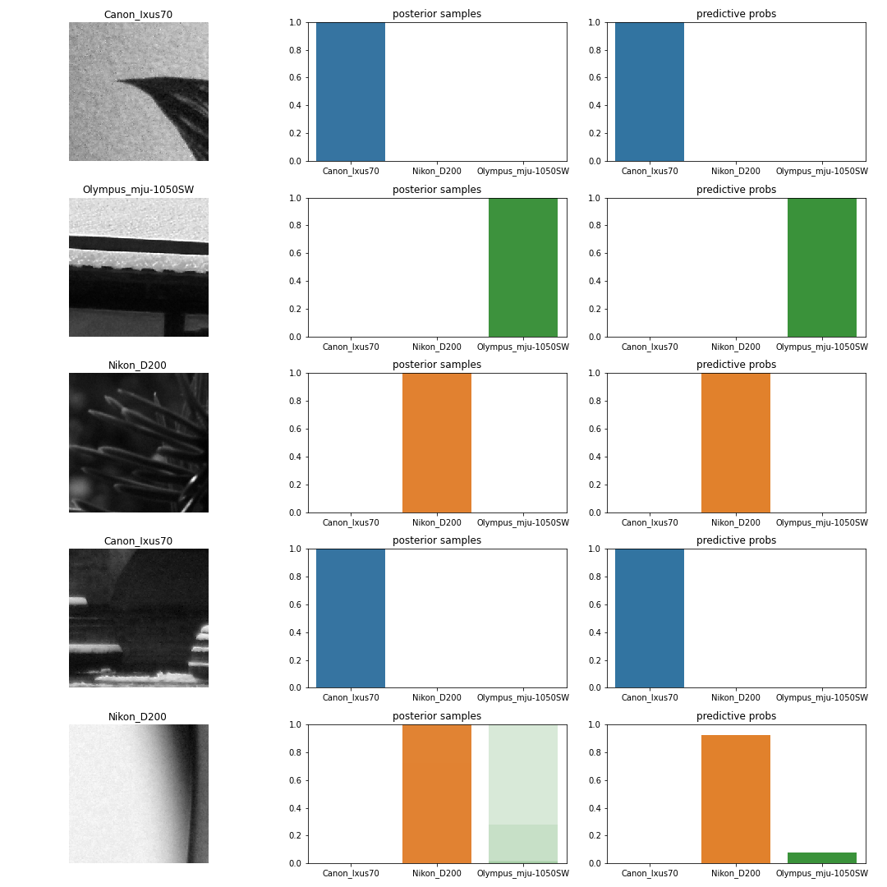
  - 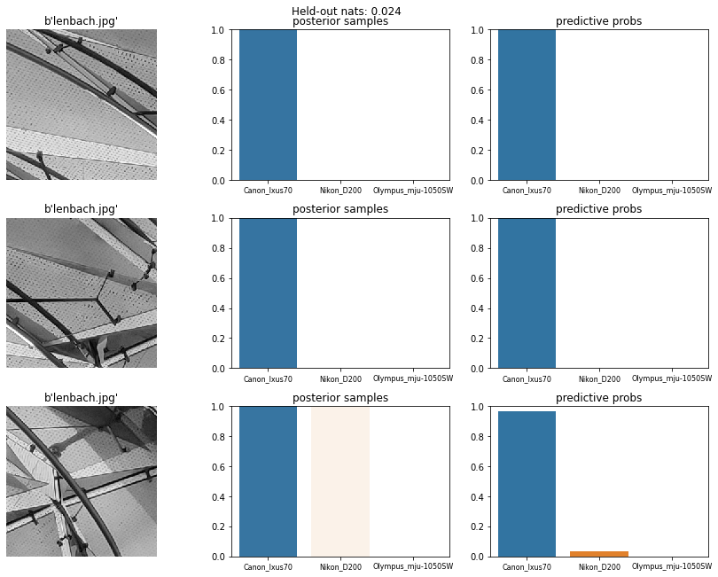
  - 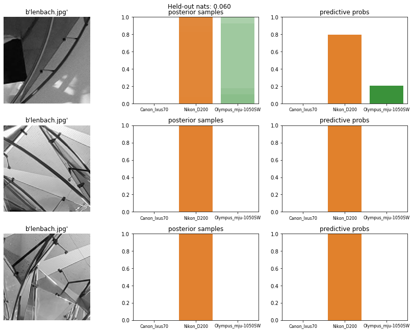
  - 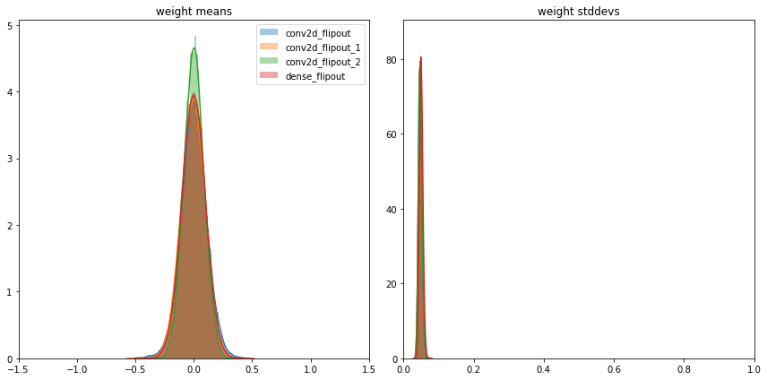

- using number of batches as kl_weights, the model converge slowly and diverge after 6 epochs, but the ouput uncertainty is not improved.(I expect it would have a good distribution of weight)
  - Result: test loss: 48.905, test accuracy: 79.955% (because its not converging, model using the 6th training epochs, val_loss: 777.0889, val_accuracy: 0.8173), outputs entropy has 0.292 nats. 
  - 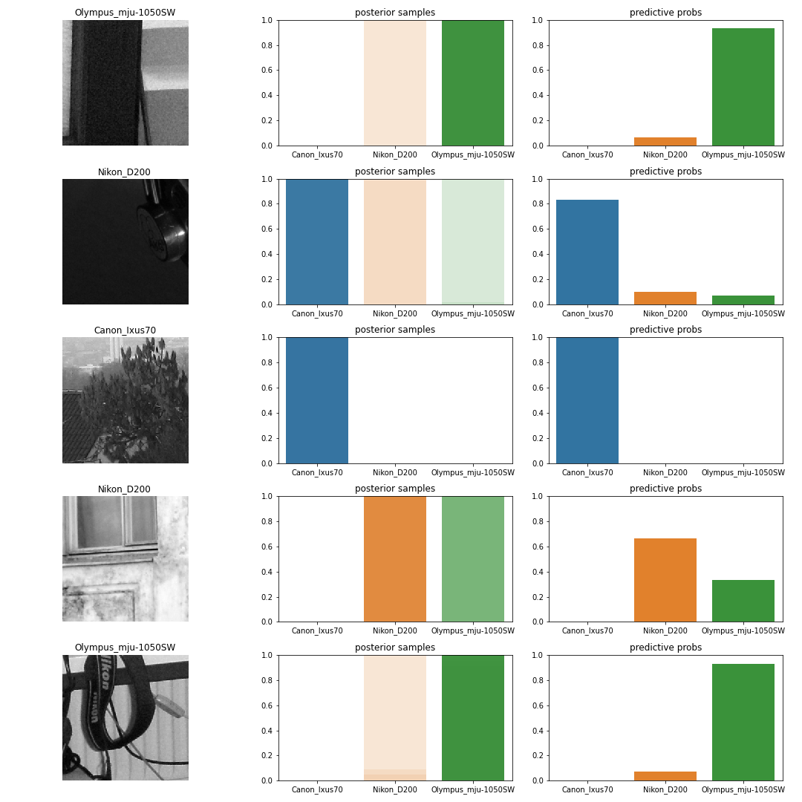
  - 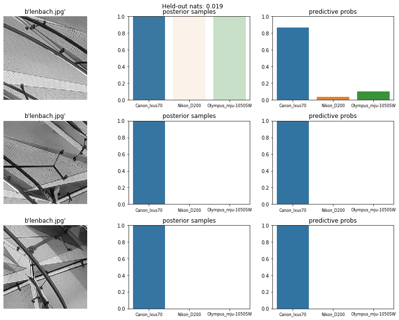
  - 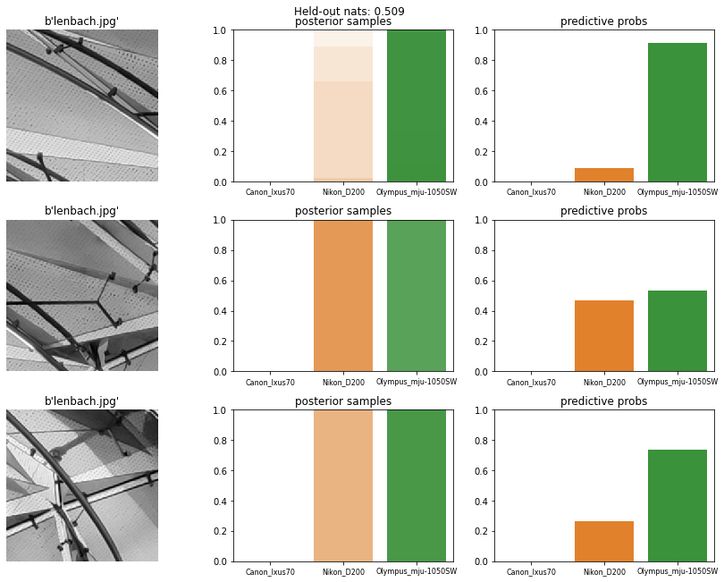
  - 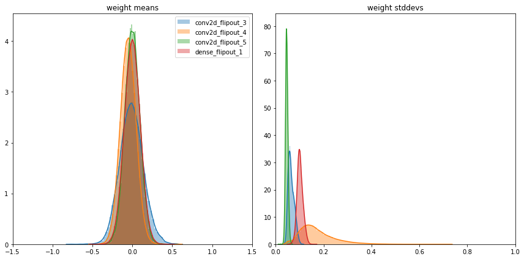

- using model.add is not the same as defining the sequential model straightfowardly. (bug on tfp)


Todo:
- [ ] Why my code has different loss, about a half of the loss of keras code?
- [ ] Tweak the kl_weight.
- [ ] set `kl_weight` to 0 to see if the model will converge, if it does, nothing wrong with the initialization.
- [ ] use scalar to describe the variance of prediction.

## Week 8

The default initialization of the `kernel_posterior` is:

```python
tfp.layers.default_mean_field_normal_fn(
    is_singular=False, loc_initializer=tf1.initializers.random_normal(stddev=0.1),
    untransformed_scale_initializer=tf1.initializers.random_normal(mean=-3.0,
    stddev=0.1), loc_regularizer=None, untransformed_scale_regularizer=None,
    loc_constraint=None, untransformed_scale_constraint=None
)
```
The **mean** of the `kernel_posterior` is intialized by a zero mean with 0.1 stddev Gaussian, the **standard deviation** is initialized by a -3.0 mean with 0.1 standard deviation (before softplus, so this is the $\rho$). After softplus it is 0.04858735157374196 (`np.log(1 + np.exp(-3))`).

The `kernel_prior` is a standard normal distribution (0 mean with 1 standarddeviation). After training, the `kernel_posterior` should shift towards the `kernel_prior`.

The dataset has 41,325 training images, 1292 batches.

### Problem
- When set the kl_weight to num_batches, the kl loss becomes negative.
- [x] using the epsitemic and aleatoric decomposition from the [code](https://gitlab.cs.fau.de/snippets/101), it will be a K by K matrix, where K is the number of classes. Does the diagonal of this matrix indicates the uncertainty? (It's a auto covariance matrix to me.) 
  - [answer from kwon](https://github.com/ykwon0407/UQ_BNN/issues/3#issuecomment-452525593)
  - Also, there is a way to calculate the uncertainty (here)[https://github.com/ykwon0407/UQ_BNN/issues/3#issuecomment-455529058]


### 10 times num_batches

trained 10 epochs, diverge after 5 epochs, 

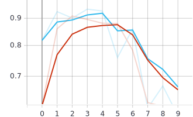
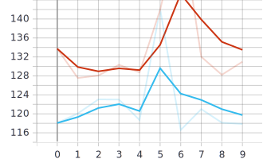


```
Epoch 1/10
loss: 133.7316 - accuracy: 0.6160 - val_loss: 118.0698 - val_accuracy: 0.8176
Epoch 2/10
loss: 127.5537 - accuracy: 0.8601 - val_loss: 120.0852 - val_accuracy: 0.9262
Epoch 3/10
loss: 128.0877 - accuracy: 0.9088 - val_loss: 123.0477 - val_accuracy: 0.9007
Epoch 4/10
loss: 130.3315 - accuracy: 0.8952 - val_loss: 123.0095 - val_accuracy: 0.9362
Epoch 5/10
loss: 128.7409 - accuracy: 0.8810 - val_loss: 118.6900 - val_accuracy: 0.9288
Epoch 6/10
loss: 141.9019 - accuracy: 0.8795 - val_loss: 142.1279 - val_accuracy: 0.7591
Epoch 7/10
loss: 160.6388 - accuracy: 0.7838 - val_loss: 116.5953 - val_accuracy: 0.8590
Epoch 8/10
loss: 132.0206 - accuracy: 0.6244 - val_loss: 120.9902 - val_accuracy: 0.6095
Epoch 9/10
loss: 128.2323 - accuracy: 0.6142 - val_loss: 118.1300 - val_accuracy: 0.6710
Epoch 10/10
loss: 130.9932 - accuracy: 0.6074 - val_loss: 117.8660 - val_accuracy: 0.5899
```
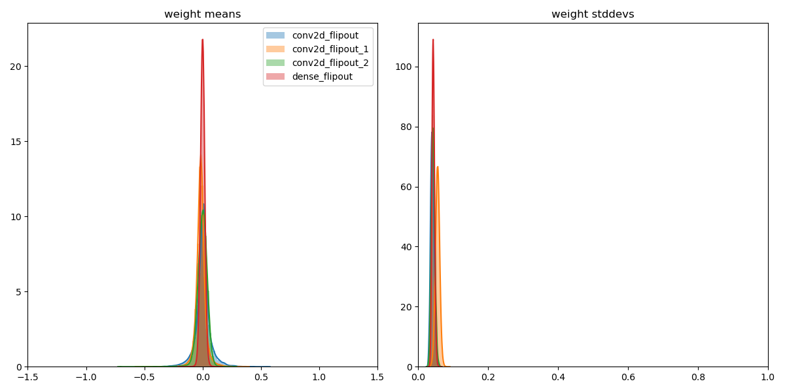

mean of mean is -0.005809836555272341, mean variance is 0.05363716930150986
12 out of 25 patches output high variance, others are over confident on Canon Ixus70.

```python
def make_prior_fn_for_empirical_bayes(init_scale_mean=-1, init_scale_std=0.1):
    """Returns a prior function with stateful parameters for EB models."""
    def prior_fn(dtype, shape, name, _, add_variable_fn):
        """A prior for the variational layers."""
        untransformed_scale = add_variable_fn(
            name=name + '_untransformed_scale',
            shape=(1,),
            initializer=tf.compat.v1.initializers.random_normal(
                mean=init_scale_mean, stddev=init_scale_std),
            dtype=dtype,
            trainable=False)
        loc = add_variable_fn(
            name=name + '_loc',
            initializer=keras.initializers.Zeros(),
            shape=shape,
            dtype=dtype,
            trainable=True)
        scale = 1e-6 + tf.nn.softplus(untransformed_scale)
        dist = tfd.Normal(loc=loc, scale=scale)
        batch_ndims = tf.size(input=dist.batch_shape_tensor())
        return tfd.Independent(dist, reinterpreted_batch_ndims=batch_ndims)
    return prior_fn
```

Change the init_prior_scale_mean from -1.9994 (after softplus 0.12699955169791002) to -3 (after softplus 0.04858735157374196).
-3 is the default value when without eb.

### 10 times num_batches with empirical bayes

```
Epoch 1/10 
loss: 116.6549 - accuracy: 0.4297 - val_loss: 76.1993 - val_accuracy: 0.5235
Epoch 2/10
loss: 56.2346 - accuracy: 0.5342 - val_loss: 28.1259 - val_accuracy: 0.6680
Epoch 3/10
loss: 20.1925 - accuracy: 0.7512 - val_loss: 3.9227 - val_accuracy: 0.8650
Epoch 4/10
loss: 3.8699 - accuracy: 0.8735 - val_loss: -1.9055 - val_accuracy: 0.8535
Epoch 5/10
loss: -6.5991 - accuracy: 0.9306 - val_loss: -10.5771 - val_accuracy: 0.9449
Epoch 6/10
loss: -10.8080 - accuracy: 0.9437 - val_loss: -13.0366 - val_accuracy: 0.9685
Epoch 7/10
loss: -7.1047 - accuracy: 0.9465 - val_loss: -5.1038 - val_accuracy: 0.9506
Epoch 8/10
loss: -0.2450 - accuracy: 0.9366 - val_loss: -3.7718 - val_accuracy: 0.9139
Epoch 00008: early stopping
saved trained_posterior.png
mean of mean is 0.003459890838712454, mean variance is 0.040473055094480515
```
Why negative loss?


```
5_train_size_eb
Epoch 1/10
loss: 33.4830 - accuracy: 0.5599 - val_loss: 27.7630 - val_accuracy: 0.6118
Epoch 2/10
loss: 35.9914 - accuracy: 0.6383 - val_loss: 26.6323 - val_accuracy: 0.5419                                                                         
Epoch 3/10
loss: 30.7481 - accuracy: 0.6981 - val_loss: 20.4589 - val_accuracy: 0.7048                                                                         
Epoch 4/10
loss: 24.0680 - accuracy: 0.8220 - val_loss: 17.2153 - val_accuracy: 0.8588                                                                         
Epoch 5/10
loss: 24.5107 - accuracy: 0.8579 - val_loss: 16.5920 - val_accuracy: 0.9078                                                                         
Epoch 6/10
loss: 29.8542 - accuracy: 0.8400 - val_loss: 20.4721 - val_accuracy: 0.8602                                                                         
Epoch 7/10
loss: 37.0488 - accuracy: 0.8343 - val_loss: 21.1433 - val_accuracy: 0.6466 
```

## Week 9

- output score of epistemic uncertainty for the images
- plot ROC curve?

About aleatoric and epistemic uncertainty
> In a nutshell, viewing a model’s aleatoric uncertainty output should caution us to factor in appropriate deviations when making our predictions, while inspecting epistemic uncertainty should help us re-think the appropriateness of the chosen model.


## Note

### ELBO

$$ ELBO(\theta) = - \int dw Q(w;\theta) log P(Y|X, w) + \int dw Q(w;\theta) log \frac{Q(w;\theta)}{P(w)} $$

ELBO uses three distributions:
- $P(w)$ is the prior over the weights. It is the distribution we assume the weights to follow before we trained the model.
- $Q(w; θ)$ is the variational posterior parameterized by parameters θ. This is an approximation to the distribution of the weights after we have trained the model.
- $P(Y | X, w)$ is the likelihood function relating all inputs $X$, all labels $Y$ and the weights. When used as a probability distribution over $Y$, it specifies the variation in $Y$ given $X$ and the weights.

ELBO is a lower bound on $log P(Y | X)$, i.e. the log-likelihood of the labels given the inputs after marginalizing away the uncertainty over the weights. **ELBO works by trading off the KL divergence of $Q$ with respect to the prior over the weights (the second term), with the ability to predict labels from the inputs (the first term).** When there is little data, the second term dominates and our weights remain close to the prior distribution, which as a side effect helps prevent overfitting.

### Regression

Fit model to the data by maximizing the probability of the labels, or equivalently, minimizing the negative log-likelihood loss: $-log P(y | x)$.

Mean squared error loss for continuous labels, for example, means that $P(y | x, w)$ is a normal distribution with a fixed scale (standard deviation). Cross-entropy loss for classification means that $P(y | x, w)$ is the categorical distribution.

### [Empirical Bayes](https://colab.research.google.com/github/CamDavidsonPilon/Probabilistic-Programming-and-Bayesian-Methods-for-Hackers/blob/master/Chapter6_Priorities/Ch6_Priors_TFP.ipynb#scrollTo=DD_MDbroh3zQ&line=25&uniqifier=1)

While not a true Bayesian method, *empirical Bayes* is a trick that combines frequentist and Bayesian inference. As mentioned previously, for (almost) every inference problem there is a Bayesian method and a frequentist method. The significant difference between the two is that Bayesian methods have a prior distribution, with hyperparameters $\alpha$, while empirical methods do not have any notion of a prior. Empirical Bayes combines the two methods by using frequentist methods to select $\alpha$, and then proceeds with Bayesian methods on the original problem. 

A very simple example follows: suppose we wish to estimate the parameter $\mu$ of a Normal distribution, with $\sigma = 5$. Since $\mu$ could range over the whole real line, we can use a Normal distribution as a prior for $\mu$. How to select the prior's hyperparameters, denoted ($\mu_p, \sigma_p^2$)? The $\sigma_p^2$ parameter can be chosen to reflect the uncertainty we have. For $\mu_p$, we have two options:

**Option 1**: Empirical Bayes suggests using the empirical sample mean, which will center the prior around the observed empirical mean:

$$ \mu_p = \frac{1}{N} \sum_{i=0}^N X_i $$

**Option 2**: Traditional Bayesian inference suggests using prior knowledge, or a more objective prior (zero mean and fat standard deviation).

Empirical Bayes can be argued as being semi-objective, since while the choice of prior model is ours (hence subjective), the parameters are solely determined by the data.

Personally, I feel that Empirical Bayes is *double-counting* the data. That is, we are using the data twice: once in the prior, which will influence our results towards the observed data, and again in the inferential engine of MCMC. This double-counting will understate our true uncertainty. To minimize this double-counting, I would only suggest using Empirical Bayes when you have *lots* of observations, else the prior will have too strong of an influence. I would also recommend, if possible, to maintain high uncertainty (either by setting a large $\sigma_p^2$ or equivalent.)

Empirical Bayes also violates a theoretical axiom in Bayesian inference. The textbook Bayesian algorithm of:

>*prior* $\Rightarrow$ *observed data* $\Rightarrow$ *posterior* 

is violated by Empirical Bayes, which instead uses 

>*observed data* $\Rightarrow$ *prior* $\Rightarrow$ *observed data* $\Rightarrow$ *posterior*

Ideally, all priors should be specified *before* we observe the data, so that the data does not influence our prior opinions (see the volumes of research by Daniel Kahneman *et. al* about [anchoring](http://en.wikipedia.org/wiki/Anchoring_and_adjustment)).